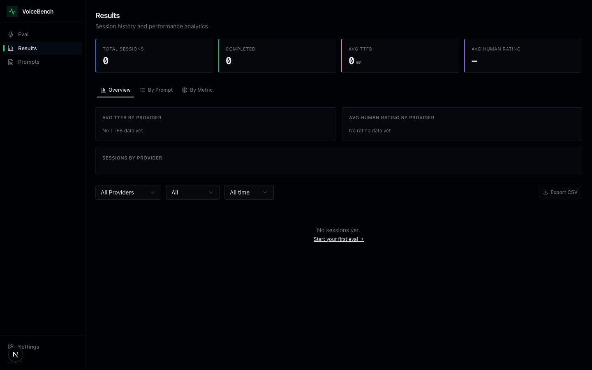
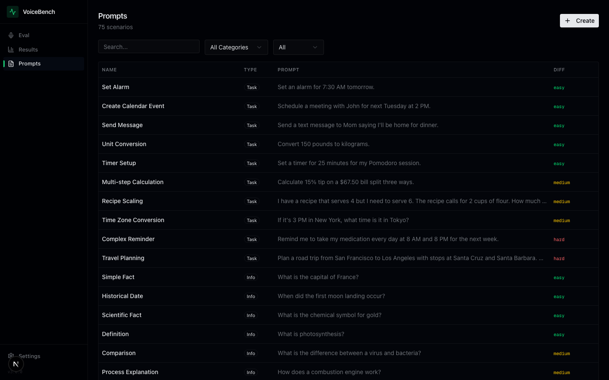
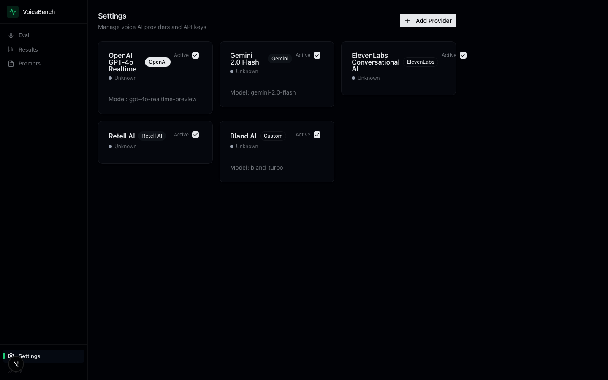

<p align="center">
  <h1 align="center">🎙️ VoiceBench</h1>
  <p align="center">
    Open-source voice AI evaluation workbench for dev teams
  </p>
</p>

<p align="center">
  <a href="https://github.com/mhmdez/voicebench/blob/main/LICENSE"></a>
  <a href="https://nextjs.org"></a>
  <a href="https://www.typescriptlang.org"></a>
  <a href="https://tailwindcss.com"></a>
  <a href="https://orm.drizzle.team"></a>
</p>

<p align="center">
  <a href="#-quick-start">Quick Start</a> •
  <a href="#-features">Features</a> •
  <a href="#-screenshots">Screenshots</a> •
  <a href="#-architecture">Architecture</a> •
  <a href="#-providers">Providers</a> •
  <a href="#-contributing">Contributing</a>
</p>

---

## What is VoiceBench?

**VoiceBench** is an open-source evaluation workbench for teams building voice AI applications. Hook up your voice providers, run real conversations against evaluation prompts, and get comprehensive quality metrics — both auto-detected and human-rated — in one place.

If you're building a voice agent and your current eval process is "listen to it and see if it sounds okay," this is for you.

### The Problem

Voice AI teams lack standardized tooling to evaluate their agents. Text LLMs have dozens of eval frameworks. Voice agents? You're on your own. You can't easily answer:

- How fast does my agent respond? (TTFB, latency)
- How accurate is the speech recognition? (WER)
- Does it sound natural? Handle interruptions well? (Human judgment)
- How does Provider A compare to Provider B on the same prompts?
- Are we getting better or worse over time?

### The Solution

VoiceBench gives you a structured workflow: **pick a provider → pick a prompt → have a conversation → rate the responses → analyze across sessions.** Auto-detected metrics (latency, WER, speech rate) are captured automatically. Human quality metrics (naturalness, emotion, turn-taking) are one-click ratings per turn. Everything feeds into a cross-session analytics dashboard you can filter by provider, prompt, or metric.

## 📸 Screenshots

### Live Eval — Conversation with Real-Time Metrics
Start a session with any configured provider. Auto metrics update live. Rate each turn on 8 quality dimensions with one click.


### Results — Cross-Session Analytics
Compare providers, analyze by prompt, break down by metric. Export to CSV.



### Prompts — 75+ Evaluation Scenarios
Built-in scenarios across task completion, information retrieval, and conversation flow. Create your own or import from YAML.



### Settings — Provider Configuration
Add and manage voice AI providers. Test connections before running evals.



## 🚀 Quick Start

### Prerequisites

- **Node.js 20+**
- **npm** or **pnpm**
- SQLite (bundled via better-sqlite3)

### Installation

```bash
git clone https://github.com/mhmdez/voicebench.git
cd voicebench

npm install

cp .env.example .env.local
# Add your provider API keys to .env.local

npm run db:push

npm run dev
```

Open [http://localhost:3000](http://localhost:3000) — you'll land on the Live Eval page.

### Environment Variables

```env
# Database (SQLite, local by default)
DATABASE_URL=./data/voicebench.db

# Provider keys (add via Settings UI or env)
OPENAI_API_KEY=sk-...
GOOGLE_API_KEY=...
RETELL_API_KEY=...

# Judge model for automated scoring (optional)
JUDGE_MODEL=gpt-4o
JUDGE_API_KEY=sk-...

# Whisper for transcription/WER (optional)
WHISPER_API_KEY=sk-...
```

## ✨ Features

### 🎯 Live Eval

The core workflow:

1. **Choose provider + prompt** — Select from configured providers and 75+ built-in scenarios, or type a freestyle prompt
2. **Converse** — Multi-turn conversation with the voice agent
3. **Rate per turn** — Quick thumbs up/down on 8 quality dimensions
4. **Watch metrics live** — Auto-detected metrics and sparkline trends update after each turn
5. **End & save** — Session saved with full metrics for cross-session analysis

### 📊 Auto-Detected Metrics

Measured automatically during every conversation — no manual work required:

| Metric | What it measures |
|--------|-----------------|
| **TTFB** | Time to first byte — how fast the agent starts responding |
| **Response Time** | Total end-to-end response latency |
| **Word Count** | Response verbosity per turn |
| **Speech Rate** | Words per minute — pacing analysis |
| **WER** | Word Error Rate — transcription accuracy vs expected |
| **Audio Duration** | Length of audio responses in seconds |

Real-time sparkline charts show trends across turns so you can spot degradation mid-conversation.

### 👤 Human Rating Metrics

Some things only a human can judge. One click per turn, per metric:

| Metric | What it captures |
|--------|-----------------|
| **Naturalness** | Does it sound like a real person talking? |
| **Prosody** | Rhythm, stress, intonation — the musicality of speech |
| **Emotion** | Appropriate emotional expression for the context |
| **Accuracy** | Factual correctness of the agent's responses |
| **Helpfulness** | Did it actually help accomplish the task? |
| **Efficiency** | Got to the point without unnecessary rambling? |
| **Turn-taking** | Natural conversational flow and response timing |
| **Interruption Handling** | Graceful handling when the user interrupts |

Three-state rating: 👍 positive, 👎 negative, or — neutral (skip). Designed for speed — you can rate a full conversation in seconds.

### 📈 Analytics Dashboard

The Results page aggregates data across all your eval sessions with three analysis views:

**Overview** — Provider comparison with horizontal bar charts showing average TTFB and human ratings side-by-side. Instantly see which provider performs best.

**By Prompt** — Which scenarios each provider handles well or poorly. Sorted by usage count. Click a prompt to filter the session table.

**By Metric** — Per-metric distribution across all sessions. Color-coded: green (>70%), orange (40-70%), red (<40%). See exactly where each provider falls short.

Plus: CSV export of any filtered view, date range filtering (7d/30d/all), provider and status filters.

### 📝 Prompts Library

75+ built-in evaluation scenarios organized by category:

- **Task Completion** — Restaurant booking, appointment scheduling, order placement, travel planning
- **Information Retrieval** — FAQ lookup, product details, weather queries, knowledge questions
- **Conversation Flow** — Multi-turn dialogue, context retention, topic switching, error recovery

Each scenario includes difficulty rating (easy/medium/hard), expected outcome, and tags. Create custom prompts via the UI or bulk import from YAML.

## 🔌 Providers

Extensible adapter architecture — add any voice AI provider:

| Provider | Type | Pipeline | Status |
|----------|------|----------|--------|
| **OpenAI Realtime** | `openai` | Whisper → GPT-4o → TTS | ✅ Built-in |
| **Google Gemini** | `gemini` | Gemini multimodal → Cloud TTS | ✅ Built-in |
| **Retell AI** | `retell` | End-to-end voice agent API | ✅ Built-in |
| **ElevenLabs** | `elevenlabs` | Coming soon | 🔜 |
| **Custom** | `custom` | Bring your own endpoint | ✅ Supported |

Configure providers through the Settings UI or programmatically:

```bash
# OpenAI Realtime
curl -X POST http://localhost:3000/api/providers \
  -H "Content-Type: application/json" \
  -d '{
    "name": "GPT-4o Realtime",
    "type": "openai",
    "config": { "apiKey": "sk-...", "model": "gpt-4o-realtime", "voiceId": "nova" }
  }'
```

### Writing a Custom Adapter

```typescript
import { ProviderAdapter } from '@/lib/providers/base-adapter';
import type { AudioPrompt, ProviderResponse } from '@/lib/providers/types';

export class MyAdapter extends ProviderAdapter {
  async generateResponse(prompt: AudioPrompt): Promise<ProviderResponse> {
    // Your voice provider logic here
    // Return: { audioBuffer, transcript, metadata }
  }

  async healthCheck() {
    // Return: { healthy: boolean, latencyMs: number }
  }
}
```

## 🏗️ Architecture

```
voicebench/
├── src/
│   ├── app/
│   │   ├── api/
│   │   │   ├── eval/         # Sessions, turns, ratings, analytics
│   │   │   ├── providers/    # Provider CRUD + health checks
│   │   │   └── scenarios/    # Prompt management + YAML import
│   │   ├── eval/
│   │   │   ├── live/         # Live conversation + real-time metrics
│   │   │   └── demo/         # Demo with sample data
│   │   ├── results/          # Analytics dashboard + session detail
│   │   ├── prompts/          # Scenario library management
│   │   └── settings/         # Provider configuration
│   ├── components/
│   │   ├── layout/           # Sidebar navigation
│   │   ├── settings/         # Provider form + list
│   │   └── ui/               # shadcn/ui components
│   ├── db/                   # Drizzle ORM schemas (SQLite)
│   ├── lib/
│   │   ├── providers/        # Adapter system (OpenAI, Gemini, Retell)
│   │   ├── eval/             # WER calculator, metrics collector, LLM judge
│   │   └── services/         # Business logic
│   └── types/                # TypeScript interfaces
├── data/                     # SQLite database (gitignored)
└── docs/                     # Screenshots, architecture docs
```

### Tech Stack

| Layer | Technology |
|-------|-----------|
| **Framework** | Next.js 16 (App Router, React 19) |
| **Language** | TypeScript 5 |
| **Database** | SQLite + Drizzle ORM |
| **UI** | shadcn/ui, Tailwind CSS 4 |
| **State** | Zustand |
| **Validation** | Zod |

## 📜 Scripts

```bash
npm run dev          # Development server (localhost:3000)
npm run build        # Production build
npm run db:push      # Push schema to database
npm run db:seed      # Seed sample data + demo prompts
npm run db:studio    # Open Drizzle Studio (DB browser)
```

## 🤝 Contributing

Contributions welcome:

1. Fork the repo
2. Create a feature branch (`git checkout -b feat/my-feature`)
3. Make sure `npm run build` passes
4. Open a PR

Ideas for contributions:
- New provider adapters (ElevenLabs, PlayHT, Deepgram)
- Additional auto-detected metrics
- Batch evaluation mode (run N prompts sequentially)
- Real-time audio waveform visualization
- Team/workspace features

## 📄 License

MIT — see [LICENSE](./LICENSE) for details.

## 📬 Contact

Questions, feedback, or want to collaborate? Reach out at **mhmdez@me.com**.

---

<p align="center">
  Built for teams shipping voice AI
</p>
