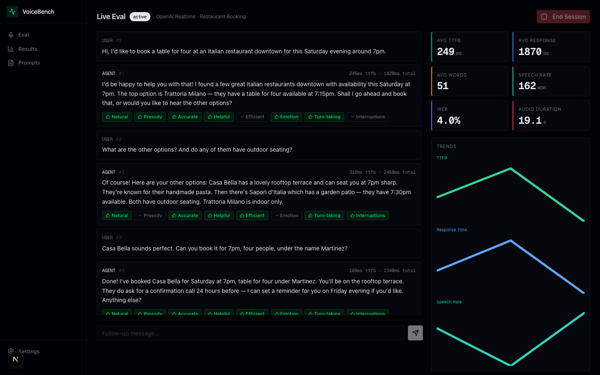

<p align="center">
  <h1 align="center">🎙️ VoiceBench</h1>
  <p align="center">
    Open-source voice AI evaluation platform — Chatbot Arena for speech-to-speech models
  </p>
</p>

<p align="center">
  <a href="https://github.com/mhmdez/voicebench/blob/main/LICENSE"></a>
  <a href="https://nextjs.org"></a>
  <a href="https://www.typescriptlang.org"></a>
  <a href="https://tailwindcss.com"></a>
  <a href="https://orm.drizzle.team"></a>
</p>

<p align="center">
  <a href="#-quick-start">Quick Start</a> •
  <a href="#-features">Features</a> •
  <a href="#-screenshots">Screenshots</a> •
  <a href="#-architecture">Architecture</a> •
  <a href="#-providers">Providers</a> •
  <a href="#-contributing">Contributing</a>
</p>

---

## What is VoiceBench?

**VoiceBench** is an open-source platform for blind A/B comparison of speech-to-speech AI models with Elo rankings and automated evaluation metrics. Think [Chatbot Arena](https://arena.lmsys.org/) meets [Hamming](https://www.hamming.ai/), but for voice.

- 🎯 **Arena Mode** — Blind comparisons with crowd-sourced voting
- 📊 **Eval Framework** — Automated benchmarks with LLM judge scoring
- 🏆 **Elo Leaderboard** — Statistical rankings with confidence intervals
- 🔌 **Multi-Provider** — OpenAI, Google Gemini, Retell AI, ElevenLabs, and custom adapters

## 🚀 Quick Start

### Prerequisites

- **Node.js 20+**
- **npm** or **pnpm**
- SQLite (bundled via better-sqlite3)

### Installation

```bash
# Clone the repository
git clone https://github.com/mhmdez/voicebench.git
cd voicebench

# Install dependencies
npm install

# Set up environment variables
cp .env.example .env.local

# Push database schema
npm run db:push

# Start development server
npm run dev
```

Open [http://localhost:3000](http://localhost:3000) to access VoiceBench.

### Environment Variables

Create a `.env.local` file:

```env
# Required for provider testing and evaluations
OPENAI_API_KEY=sk-...

# Google Gemini (optional)
GOOGLE_API_KEY=...

# Retell AI (optional)
RETELL_API_KEY=...

# Judge model configuration (optional)
JUDGE_MODEL=gpt-4o
JUDGE_API_KEY=sk-...  # Defaults to OPENAI_API_KEY

# Whisper transcription (optional)
WHISPER_API_KEY=sk-...  # Defaults to OPENAI_API_KEY
```

## ✨ Features

### 🎯 Arena Mode

Blind A/B comparisons of voice AI providers with crowd-sourced human preferences:

1. **Select Category** — General, customer support, creative, multilingual, etc.
2. **Listen Blind** — Hear two anonymous AI responses to the same prompt
3. **Vote** — Pick the better response or call it a tie (keyboard shortcuts included)
4. **Reveal** — Provider identity revealed, Elo ratings update in real time

### 📊 Evaluation Framework

Run systematic benchmarks across multiple providers:

- **LLM Judge Scoring** — AI-powered quality assessment across accuracy, helpfulness, naturalness, and efficiency
- **WER Calculation** — Word Error Rate for transcription accuracy
- **Latency Metrics** — Time-to-first-byte (TTFB) and total response time
- **Export** — Download results as JSON or CSV

### 🔌 Provider Adapters

Extensible adapter architecture supporting:

| Provider | Type | Pipeline |
|----------|------|----------|
| **OpenAI** | `openai` | Whisper → GPT-4o → TTS |
| **Google Gemini** | `gemini` | Gemini multimodal → Cloud TTS |
| **Retell AI** | `retell` | End-to-end voice agent API |
| **ElevenLabs** | `elevenlabs` | Coming soon |
| **Custom** | `custom` | Bring your own endpoint |

### 🏆 Elo Leaderboard

Live provider rankings with:
- Elo rating system based on match outcomes
- Category-specific rankings
- Match count and win rate tracking
- Statistical confidence indicators

## 📸 Screenshots

> *Screenshots coming soon — run the project locally to see it in action!*

| Arena Mode | Leaderboard | Evaluation |
|:---:|:---:|:---:|
|  |  |  |

## 🏗️ Architecture

```
voicebench/
├── src/
│   ├── app/              # Next.js App Router pages & API routes
│   │   ├── api/          # REST API endpoints
│   │   │   ├── arena/    # Match generation, voting, leaderboard
│   │   │   ├── eval/     # Evaluation runs and exports
│   │   │   ├── providers/# Provider CRUD
│   │   │   └── scenarios/# Scenario import
│   │   ├── arena/        # Arena comparison UI
│   │   ├── eval/         # Evaluation dashboard
│   │   ├── leaderboard/  # Public rankings
│   │   └── settings/     # Provider configuration
│   ├── components/       # React components (shadcn/ui based)
│   │   ├── arena/        # MatchView, VoteButtons, RevealView
│   │   ├── audio/        # AudioPlayer, Waveform
│   │   ├── charts/       # ScoreRadar, MetricsBar, EloTrend
│   │   └── ui/           # shadcn/ui primitives
│   ├── db/               # Drizzle ORM schemas & migrations
│   ├── lib/
│   │   ├── providers/    # Provider adapter system
│   │   │   ├── base-adapter.ts          # Abstract base class
│   │   │   ├── openai-realtime-adapter.ts
│   │   │   ├── gemini-adapter.ts
│   │   │   └── retell-adapter.ts
│   │   ├── eval/         # Evaluation engine, LLM judge, WER
│   │   └── services/     # Matchmaking, Elo, Arena logic
│   ├── stores/           # Zustand state management
│   └── types/            # TypeScript interfaces
├── data/                 # SQLite database files
├── public/               # Static assets & audio files
└── docs/                 # Documentation
```

### Tech Stack

| Layer | Technology |
|-------|-----------|
| **Framework** | Next.js 16 (App Router, React 19) |
| **Language** | TypeScript 5 |
| **Database** | SQLite + Drizzle ORM |
| **UI** | shadcn/ui, Radix UI, Tailwind CSS 4 |
| **State** | Zustand + SWR |
| **Validation** | Zod |
| **Audio** | Web Audio API, custom waveform renderer |

## 🔧 Configuration

### Adding Providers

Configure voice AI providers via the Settings UI or API:

```bash
# OpenAI
curl -X POST http://localhost:3000/api/providers \
  -H "Content-Type: application/json" \
  -d '{
    "name": "GPT-4o Nova",
    "type": "openai",
    "config": { "apiKey": "sk-...", "model": "gpt-4o", "voiceId": "nova" }
  }'

# Gemini
curl -X POST http://localhost:3000/api/providers \
  -H "Content-Type: application/json" \
  -d '{
    "name": "Gemini Flash",
    "type": "gemini",
    "config": { "apiKey": "...", "model": "gemini-2.0-flash" }
  }'

# Retell AI
curl -X POST http://localhost:3000/api/providers \
  -H "Content-Type: application/json" \
  -d '{
    "name": "Retell Agent",
    "type": "retell",
    "config": { "apiKey": "...", "voiceId": "agent_xxx" }
  }'
```

### Importing Scenarios

Import evaluation scenarios from YAML:

```bash
curl -X POST http://localhost:3000/api/scenarios/import \
  -H "Content-Type: application/json" \
  -d '{
    "yaml": "version: \"1.0\"\nscenarios:\n  - id: greeting-basic\n    name: Basic Greeting\n    type: task-completion\n    prompt: \"Hello, how are you today?\"\n    expected_outcome: \"A friendly greeting response\"",
    "mode": "skip"
  }'
```

### Writing a Custom Adapter

Extend `ProviderAdapter` to add your own provider:

```typescript
import { ProviderAdapter } from '@/lib/providers/base-adapter';
import type { AudioPrompt, ProviderResponse, ProviderHealthCheck } from '@/lib/providers/types';

export class MyAdapter extends ProviderAdapter {
  constructor(options: AdapterOptions) {
    super('custom', options);
  }

  async generateResponse(prompt: AudioPrompt): Promise<ProviderResponse> {
    // Your implementation here
  }

  async healthCheck(): Promise<ProviderHealthCheck> {
    // Your implementation here
  }

  getName(): string {
    return 'My Provider';
  }
}
```

Then register it:

```typescript
import { registerAdapter } from '@/lib/providers';
registerAdapter('custom', MyAdapter);
```

## 📜 Scripts

```bash
npm run dev          # Start development server
npm run build        # Production build
npm run start        # Start production server
npm run lint         # Run ESLint
npm run db:generate  # Generate Drizzle migrations
npm run db:migrate   # Run migrations
npm run db:push      # Push schema directly (dev)
npm run db:studio    # Open Drizzle Studio
npm run db:seed      # Seed demo data
```

## 📖 Documentation

- [Architecture](./docs/ARCHITECTURE.md) — System design and data flow
- [Provider Guide](./docs/PROVIDERS.md) — Adding new provider adapters
- [Scenario Schema](./docs/SCENARIOS.md) — YAML format reference
- [API Reference](./docs/API.md) — Complete endpoint documentation

## 🤝 Contributing

Contributions welcome! Here's how:

1. Fork the repository
2. Create a feature branch (`git checkout -b feat/amazing-feature`)
3. Commit your changes (`git commit -m 'feat: add amazing feature'`)
4. Push to the branch (`git push origin feat/amazing-feature`)
5. Open a Pull Request

Please ensure `npm run build` passes before submitting.

## 📄 License

MIT License — see [LICENSE](./LICENSE) for details.

---

<p align="center">
  Built with ❤️ for the voice AI community
</p>
